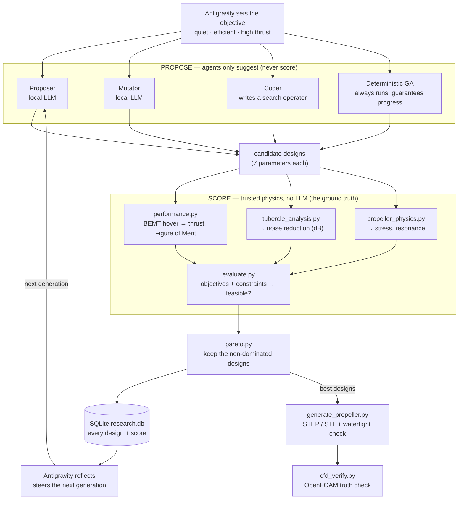
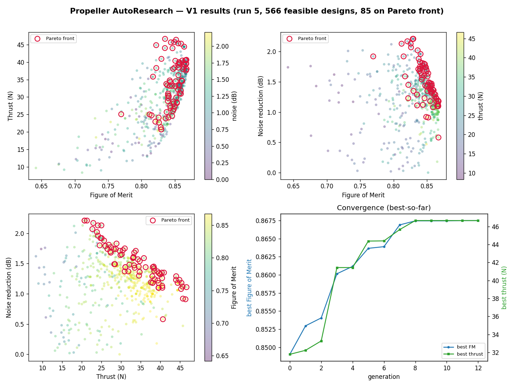
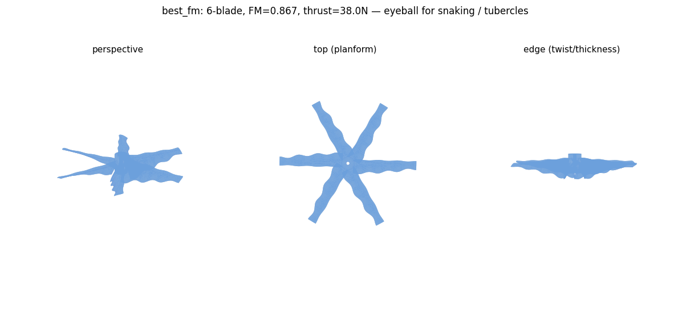

# A drone propeller, designed by a team of AIs

This project tries to answer a simple question: instead of an engineer hand-tweaking
a propeller and testing it over and over, can we let a group of AI models do that
loop themselves — and end up with a better propeller than a person would patiently
grind out by hand?

The target propeller should be three things at once: **quiet**, **efficient**
(it doesn't waste battery), and **strong** (it pushes a lot of air). Those goals
fight each other — a bigger, grippier blade gives you more thrust but more noise,
for example — so there's no single "best" answer. There's a set of good
trade-offs, and the job is to find them.

If you're new to AI agents, this is a nice thing to learn from, because it's not a
chatbot. It's AI used as a worker that actually *does* something and checks its own
results.

---

## The big idea, in plain terms

Picture a small research team where every member is a program:

- A few **junior members** are fast and cheap. Their job is to brainstorm — throw
  out lots of propeller designs, some sensible, some weird. They don't need to be
  smart, they need to be prolific. These run on your own computer with free local
  models (via Ollama), so brainstorming costs nothing.
- A **lead researcher** is the expensive, smart one. It doesn't generate the
  grunt work; it reads the results, notices patterns ("the 5-blade designs are
  getting quieter — push harder there"), and decides what the team tries next.
  That role is **Antigravity**, the agent running the show.
- A **referee** that never lies: plain, trusted math and physics code. The AIs only
  ever *propose* designs. They're never allowed to *score* their own work. The
  referee does the scoring, so a confident-but-wrong model can't fool the system.

That last point is the whole trick, and it's worth remembering as a general lesson
about AI: **let models suggest, let trusted code decide.** Models are great at
coming up with options and terrible at being a reliable judge of truth. So we use
them only for the part they're good at.

---

## How a round actually goes

The team works in a loop. One lap looks like this:

1. **Propose** — the cheap models spit out a batch of new propeller designs.
2. **Build** — code turns each design into actual 3D geometry (a real CAD file).
3. **Score** — the physics code estimates how much thrust, how much noise, and how
   efficient each one is. This first pass is fast approximate math, not a full
   simulation.
4. **Shortlist** — the system keeps the designs that aren't beaten on every goal at
   once. That surviving set is called the **Pareto front** — the current "menu" of
   best trade-offs.
5. **Reflect** — Antigravity looks at the front and steers: what's working, what to
   explore next.
6. **Write it down** — a one-line summary of the round gets logged, and the loop
   starts again.

Every so often, the most promising designs get the expensive treatment: a real
fluid-dynamics simulation (**CFD**, run locally with OpenFOAM) that models the air
actually flowing over the blade. That's slow, so we only spend it on candidates
that already look good on the cheap math.

There's one more helper worth naming: a **surrogate model** (a Gaussian Process,
from scikit-learn). Think of it as the team learning to *guess the simulation's
answer* from the designs it has already simulated — so it can skip a lot of slow
runs and spend them only where it's genuinely unsure. It's the system getting
smarter about where to look as it goes.

---

## How it works (agents + physics)

The one rule that makes this trustworthy: **the AI agents only ever *propose*
designs — they never score them.** Scoring is done by plain physics code that
can't be talked into a wrong answer. Here's the whole loop:



Read it left-to-right, top-to-bottom: the agents (and a deterministic genetic
algorithm that always runs as a safety net) throw out candidate designs → the
physics scripts score each one → the non-dominated winners are kept and saved →
Antigravity looks at the winners and steers the next round → the loop repeats.
The best designs eventually drop out the bottom into CAD and CFD verification.

---

## How it remembers (and survives a crash)

The loop can run for hours, so it can't keep everything in its head. It writes
everything to a single local database file, `data/research.db` (SQLite).

This isn't just bookkeeping. Because that database saves each result the instant
it's final, the loop can be killed — power cut, crash, you closing the laptop — and
pick up exactly where it left off instead of starting over. A human-readable diary
of the run also lands in `data/journal.md` if you just want to skim what happened.

---

## Running it

Honest version: don't start this and immediately walk away the first time. The
first run has setup to get through, and you'll want to see it work once.

You need a few things installed first:

- **Ollama** with two local models: `ollama pull qwen2.5-coder:7b` and
  `ollama pull phi4-mini`
- **OpenFOAM** (through WSL or Docker) — only needed once you reach the simulation step
- Python packages: `pip install cadquery numpy scikit-learn matplotlib`

Then, the way you actually use it: open this folder in **Antigravity** and tell it
**"go to work."** It reads [`AGENTS.md`](AGENTS.md) — its instruction sheet — and
starts working through the plan on its own, stopping to check in with you at the
points that matter.

To run the core loop by hand:

```bash
cd src
python -m autoresearch.researcher --no-llm --budget 30   # quick, no AI — sanity check
python -m autoresearch.researcher --budget 1800          # the full team
```

### The overnight run

Once you've watched it work once and you trust it, the long runs are the part you
*can* sleep through. There's a babysitter script for exactly that:

```powershell
powershell -ExecutionPolicy Bypass -File .\run_overnight.ps1
```

It restarts the loop if it crashes, refuses to run forever (there are time and
restart caps), logs everything, and leaves a one-line verdict in
`data/RUN_STATUS.txt` for you to read with your coffee. Drop a file named `STOP`
in this folder to stop it cleanly. If you wire in a Telegram token, it'll message
you when it's done.

---

## Results so far (V1)

First full run of the pipeline. The optimizer explored a few hundred feasible
designs and mapped the trade-off surface between the three goals:



The red rings are the **Pareto front** — designs that aren't beaten on all three
goals at once, i.e. the current menu of best trade-offs. The bottom-right panel
shows the search improving generation over generation.

The best efficiency pick (Figure of Merit 0.867, 38 N thrust, 6 blades) was
exported to CAD and passed the watertightness check:



> Honest caveat: these scores come from the fast analytical physics, and this
> winner sits against the edges of the allowed design range — so treat V1 as a
> working pipeline and a first map, not a final answer. CFD verification and a
> re-run with reviewed bounds come next.

Regenerate these anytime:

```bash
cd src
python plot_results.py        # docs/v1_results.png
python export_best.py         # cad/best_fm.* + validity report
```

---

## Where to look if you're poking around

| Path | What's there |
|------|--------------|
| [`implementation_plan.md`](implementation_plan.md) | The full design — read this to understand the whole system |
| [`AGENTS.md`](AGENTS.md) | The agent's instructions and the "go to work" steps |
| `src/autoresearch/skills/` | The actual prompts given to each AI worker — surprisingly readable |
| `src/optimization/` | The trusted referee: the physics and scoring code |
| `data/research.db` | The memory — every design and result |
| `cad/` | The propeller shapes it produces (STEP + Python) |

A good first move is to open one of the files in `src/autoresearch/skills/`. Those
are the plain-English instructions the AI workers are running on — it's the
clearest window into how the whole thing actually thinks.
