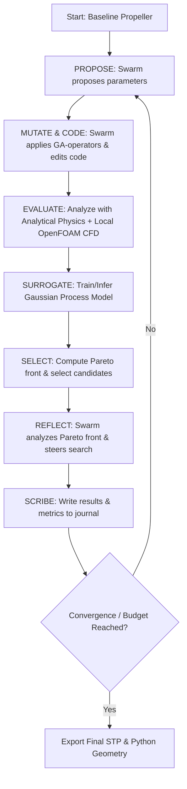
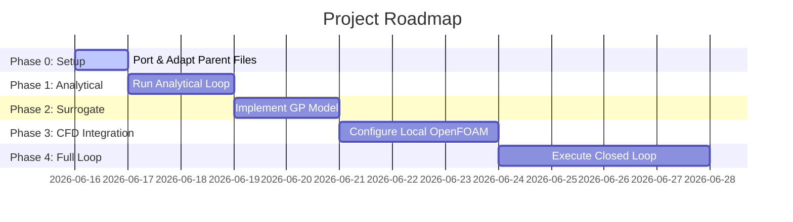

# Implementation Plan — LLM Agent Generated Quadcopter Propeller

This implementation plan outlines the design, architecture, and integration steps for a multi-agent system that autonomously optimizes a quadcopter propeller for **lowest noise**, **highest efficiency**, and **highest thrust**. 

The system leverages the **AutoResearch** loop, using **Antigravity** as the orchestrating harness, local LLM workers for code generation/diagnostics, a **Gaussian Process (GP)** surrogate model to accelerate evaluations, and local **OpenFOAM** CFD simulation for verification.

---

## Decided Architectural Framework

Based on reviews of the parent project and inline decisions, the project parameters are established as follows:

1. **Project Origin & Structure**: 
   - A copy-paste fork approach: Port relevant source files from the parent `quadcopter/` directory directly into this project workspace, pruning and tailoring them as needed.
2. **Baseline & Data Tracking**: 
   - Establish a common baseline propeller (e.g., standard APC style) and measure its performance first.
   - Track optimization metrics over time, displaying the performance trajectory across generations.
3. **Orchestrator/Harness**:
   - **Antigravity** acts as the high-level orchestrator and harness, implementing the target task/swarm skills.
4. **AutoResearch Loop**:
   - Structured as a 6-phase loop (Propose → Mutate/Code → Evaluate → Select → Reflect → Scribe) mapped in the diagram below.
5. **Surrogate Model**:
   - **Gaussian Process (scikit-learn)** is selected for its low computational cost, suitability for small-to-medium datasets, and built-in uncertainty estimation (useful for Bayesian infill criteria).
6. **CFD Simulation**:
   - Run **OpenFOAM locally** via the OpenFOAM skill.
   - The LLM will autonomously manage:
     - The mechanism to trigger CFD within the loop.
     - Mesh regeneration (snappyHexMesh) based on available local hardware resources.
     - Extraction and parsing of force outputs from `postProcessing/forces/`.
     - Error diagnostics and solver divergence recovery using local documentation and online resources.
7. **CAD Generation**:
   - Re-use and adapt the existing CadQuery code from the parent directory.
   - The LLM is allowed to modify the geometry generator script, but the final output must be exported in standard **STP** and **Python** formats.
   - Watertight CAD verification rules will be determined dynamically by the LLM.
8. **Human Intervention**:
   - **No Dead Man's Switch**. The agent will run fully autonomously within the boundaries of this folder (`LLM Agent generated Quadcopter Propeller/`) without modifying anything outside it.

---

## AutoResearch Loop Workflow

The generative geometry loop executes the following iterative optimization flow:



---

## Project Directory Structure

```
LLM Agent generated Quadcopter Propeller/
├── cad/                     # Generated STEP/STL files
├── cfd/                     # Local OpenFOAM case directories
├── data/                    # SQLite store of record (research.db), journal.md, Pareto exports
├── docs/                    # Generated reports, Pareto plots, and metric logs
├── src/
│   ├── autoresearch/        # Optimization loop orchestration
│   │   ├── researcher.py    # Loop execution control
│   │   ├── swarm.py         # LLM worker dispatch
│   │   ├── local_llm.py     # Ollama API helper
│   │   └── skills/          # LLM prompt templates
│   ├── optimization/        # Evaluation and Pareto sorting logic
│   │   ├── design.py        # Design space parameters and bounds
│   │   ├── evaluate.py      # Analytical performance evaluator
│   │   ├── performance.py   # Propeller physics equations
│   │   └── pareto.py        # Non-dominated sorting
│   ├── surrogate/           # Gaussian Process training and inference
│   │   └── gp_model.py      # scikit-learn GP regressor
│   ├── generate_propeller.py # CadQuery geometry builder (STP/Python export)
│   ├── propeller_physics.py  # Physics utility library
│   └── setup_openfoam_case.py # Local CFD case setup utility
├── Plan.md                  # Project overview (git-ignored)
└── implementation_plan.md   # This plan
```

---

## LLM Routing Table

| Swarm Role | Target Model | Interface / Client | Context Details |
| :--- | :--- | :--- | :--- |
| **Orchestrator / Harness** | Antigravity | Integrated Agent | Full session workspace context |
| **Proposer** (Design Generation) | Local `qwen2.5-coder:7b` | Ollama API | Fast generation, low latency |
| **Mutator & Coder** (Code/Param adjustments) | Local `qwen2.5-coder:7b` | Ollama API | Dedicated coding model |
| **CFD Analyst / Debugger** | Local `phi4-mini` | Ollama API | Log analysis, structured fixes |
| **Reflector** (Pareto Trend Analysis) | Antigravity | Integrated Agent | Trend detection, search redirection |

---

## Objectives and Constraints

### Optimization Objectives

The optimizer targets a 3-objective Pareto front:
1. **Efficiency ($FM$)**: Maximize the aerodynamic Figure of Merit (FM) during hover, computed from Blade Element Momentum Theory (BEMT).
2. **Noise Reduction ($dB$)**: Maximize noise reduction relative to the baseline propeller (leveraging blade twist and leading-edge tubercles).
3. **Thrust ($T_{N}$)**: Maximize the total thrust generated at the design RPM.

### Optimization Constraints

To ensure design feasibility and prevent mechanical failure, the following constraints are enforced:
*   **Aeroacoustic Speed Limit**: Tip speed must remain below **Mach 0.65** ($V_{\text{tip}} < 220 \text{ m/s}$) to prevent high compressibility drag, shock formations, and severe transonic noise amplification.
*   **Structural Integrity (Stress)**: Maximum von Mises stress under aerodynamic and centrifugal loads must not exceed **30 MPa** (providing a safety factor for common 3D printed materials like PLA/PETG).
*   **Geometric Watertightness**: Mesh checks must confirm the manifold boundary volume is positive and watertight prior to snappyHexMesh generation.
*   **Resonance Avoidance**: Ensure the propeller's fundamental natural frequencies do not lie within $\pm 10\%$ of the operational rotational frequency (avoiding 1x and 2x RPM excitation).

---

## Surrogate Model Specification (Gaussian Process)

- **Library**: `scikit-learn` (`GaussianProcessRegressor` with an RBF or Matérn kernel).
- **Inputs**: $N$-dimensional design vector $x$ containing chord, twist, and tubercle parameters.
- **Outputs**: Aerodynamic forces (Thrust, Torque) and acoustic benefits predicted without running the full OpenFOAM case.
- **Integration Strategy**:
  1. **Phase 1 (Cold Start)**: Run analytical physics models to generate initial dataset ($M \approx 50$ samples).
  2. **Surrogate Training**: Train the GP model on the design parameters vs. performance metrics.
  3. **Bayesian Optimization (Infill)**: Use Expected Improvement (EI) or Upper Confidence Bound (UCB) to identify candidate designs that balance exploration (high uncertainty) and exploitation (high predicted performance).
  4. **CFD Verification**: Run full local OpenFOAM CFD on the top selected candidate to verify performance and update the training set.

---

## Data & State Persistence (SQLite store of record)

All structured run data lives in a single SQLite file, **`data/research.db`**,
created in Phase 0. SQLite is chosen because it is atomic/ACID (crash-safe — a
killed process can never corrupt a half-written row, which is what makes the
unattended auto-restart/resume reliable), queryable, server-less, and ships with
Python (`sqlite3`). It runs in **WAL mode** so progress can be inspected live
while the loop is running.

**Division of responsibility (hybrid by design):**
- **`data/research.db`** — source of truth for designs, scores, constraints, run
  state, and debug events.
- **Files** (`cad/`, `cfd/`) — large artifacts (STEP/STL, OpenFOAM cases, meshes).
  The DB stores only their *path*, never the blob.
- **`data/journal.md`** — human-readable narrative (one scribe line per generation).

**Schema:**

```sql
-- one row per optimization run; drives crash-resume
CREATE TABLE runs (
  run_id      INTEGER PRIMARY KEY,
  started_at  TEXT NOT NULL,
  finished_at TEXT,
  status      TEXT NOT NULL,            -- running | done | crashed | stopped
  phase       INTEGER NOT NULL,         -- 0..4, last phase entered
  last_gen    INTEGER DEFAULT 0,        -- last completed generation (resume point)
  config_json TEXT                      -- budget, bounds, model routing snapshot
);

-- every candidate design proposed (the 7-field vector)
CREATE TABLE designs (
  design_id      INTEGER PRIMARY KEY,
  run_id         INTEGER NOT NULL REFERENCES runs(run_id),
  generation     INTEGER NOT NULL,
  source         TEXT,                  -- proposer | mutator | coder | surrogate | baseline
  chord_root_m   REAL, chord_tip_m   REAL,
  twist_root_deg REAL, twist_tip_deg REAL,
  tubercle_amp_m REAL, tubercle_wl_m REAL,
  n_blades       INTEGER,
  created_at     TEXT NOT NULL,
  UNIQUE(run_id, chord_root_m, chord_tip_m, twist_root_deg,
         twist_tip_deg, tubercle_amp_m, tubercle_wl_m, n_blades)  -- dedup
);

-- one row per evaluation of a design (analytical or CFD)
CREATE TABLE evals (
  eval_id        INTEGER PRIMARY KEY,
  design_id      INTEGER NOT NULL REFERENCES designs(design_id),
  evaluator      TEXT NOT NULL,         -- analytical | surrogate | cfd
  fm             REAL,                  -- Figure of Merit (objective)
  thrust_n       REAL,                  -- thrust, N (objective)
  noise_db       REAL,                  -- noise reduction vs baseline, dB (objective)
  tip_mach       REAL,
  von_mises_mpa  REAL,
  watertight     INTEGER,               -- 0/1
  constraints_ok INTEGER NOT NULL,      -- 0/1, all constraints satisfied
  artifact_path  TEXT,                  -- path to STEP/CFD case if any
  evaluated_at   TEXT NOT NULL
);

-- debug / diagnostics trail (LLM I/O, solver events, errors)
CREATE TABLE events (
  event_id   INTEGER PRIMARY KEY,
  run_id     INTEGER REFERENCES runs(run_id),
  ts         TEXT NOT NULL,
  level      TEXT NOT NULL,             -- info | warn | error
  role       TEXT,                      -- proposer | mutator | cfd_analyst | researcher | ...
  message    TEXT,
  payload    TEXT                       -- raw LLM output / log tail / stack trace
);

-- Pareto front membership snapshot per generation
CREATE TABLE pareto_snapshots (
  run_id     INTEGER NOT NULL REFERENCES runs(run_id),
  generation INTEGER NOT NULL,
  design_id  INTEGER NOT NULL REFERENCES designs(design_id),
  PRIMARY KEY (run_id, generation, design_id)
);
```

**Resume contract:** on "go to work", read the latest `runs` row; if its status is
`running`/`crashed`, continue that run from `last_gen + 1`. Update `runs.status`,
`runs.phase`, and `runs.last_gen` inside the same transaction that writes a
generation's `designs`/`evals` so state and data can never disagree after a crash.

---

## Project Phases & Roadmap



| Phase | Description | Compute Mode | Human Oversight |
| :--- | :--- | :--- | :--- |
| **Phase 0** | Port existing scripts from `quadcopter/`, clean paths, configure workspace. | None | Initial file copy & validation |
| **Phase 1** | Run AutoResearch with analytical models only (no CFD) to verify parameter mapping. | CPU | Review initial optimization paths |
| **Phase 2** | Integrate the GP surrogate model, train on Phase 1 data, and configure infill criteria. | CPU | Verify GP prediction variance |
| **Phase 3** | Set up local OpenFOAM cases and build the automated result parsing/error-recovery routines. | CPU / Local Docker | Test single CFD runs for convergence |
| **Phase 4** | Run the complete closed loop: Propose → CAD → Surrogate → OpenFOAM → Select → Reflect. | Full Local Stack | Track generated metric plots over time |

---

## Verification Plan

### Automated Verification
1. **Geometry Watertightness Check**: Scripts utilizing OpenCASCADE/CadQuery will verify the volume validity and boundary shell integrity of the exported STP file.
2. **CFD Convergence Tests**: Check OpenFOAM residuals (e.g. $p, U$ residuals $< 10^{-4}$) to ensure simulations have reached steady state.
3. **Surrogate Cross-Validation**: Evaluate the GP model using leave-one-out or K-fold cross-validation on generated simulation points.

### Manual Verification
1. **Pareto Frontier Inspection**: Review the generated multi-objective Pareto front plots to confirm the trade-offs between efficiency, noise, and thrust make physical sense.
2. **Review STL/STP Renders**: Visually inspect selected geometries in CAD software to confirm smooth blending, thickness consistency, and absence of self-intersections.
